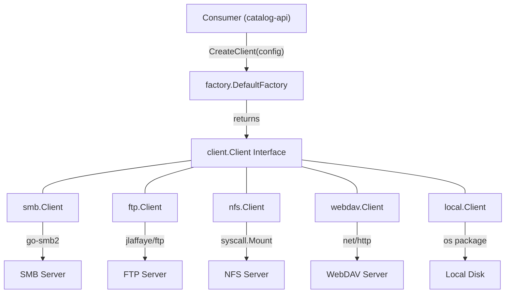
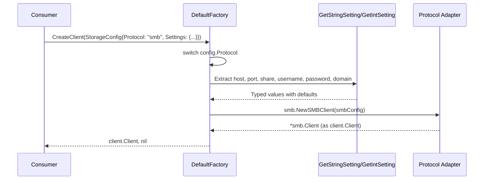
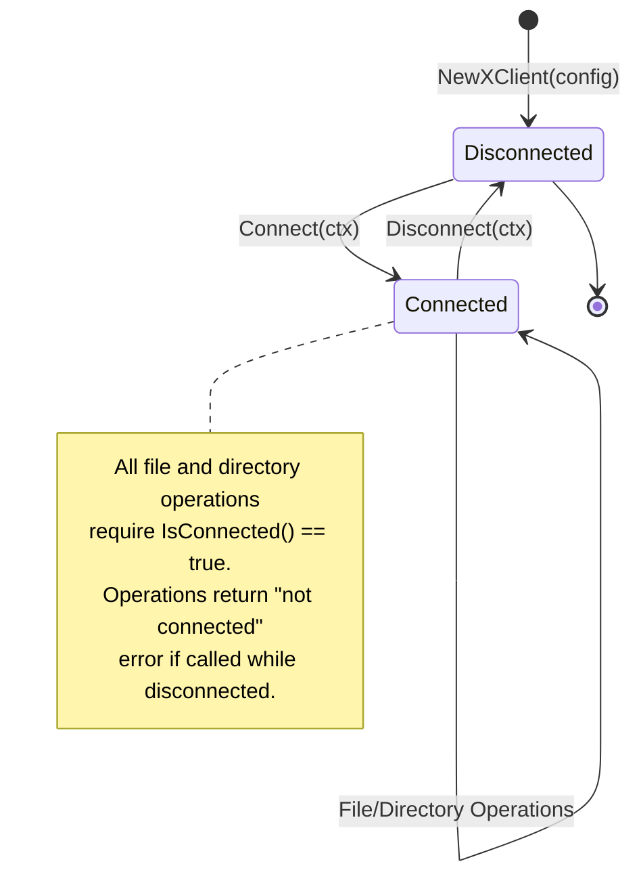
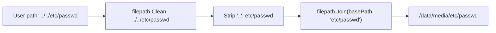
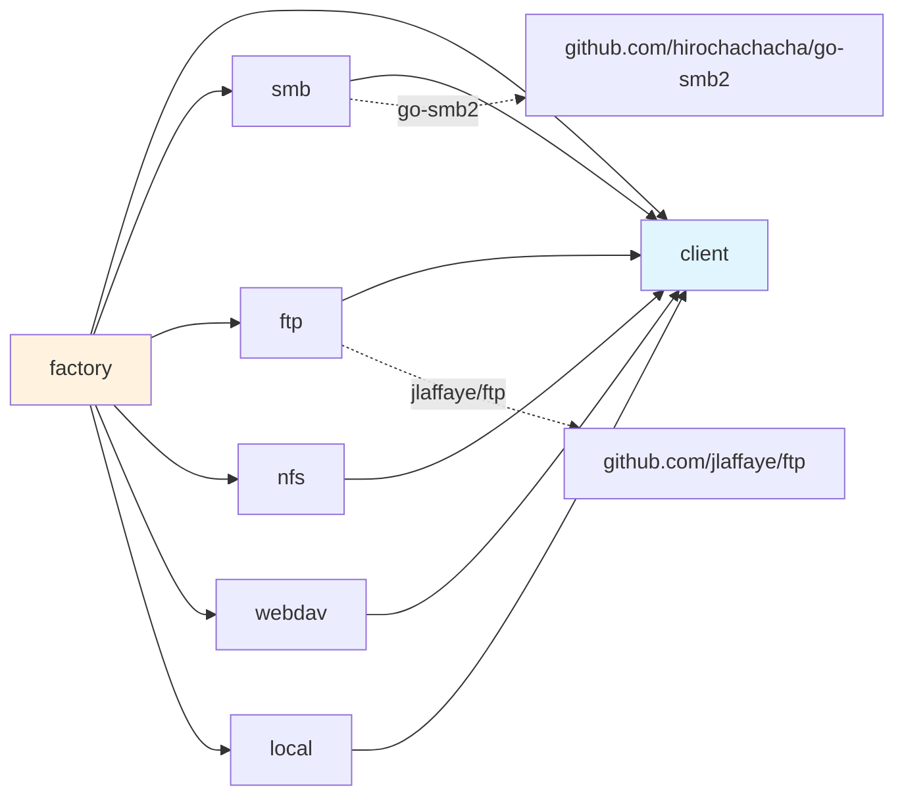

# Architecture

## Design Philosophy

The Filesystem module follows the principle of protocol-agnostic file access. Consumers interact with a single `client.Client` interface regardless of whether files reside on a local disk, an SMB share, an FTP server, a WebDAV endpoint, or an NFS mount. The factory pattern decouples client creation from usage, allowing storage backends to be configured at runtime.

## High-Level Architecture



## Factory Pattern

The `DefaultFactory` maps protocol strings to adapter constructors. It extracts typed configuration values from the generic `Settings` map and passes protocol-specific `Config` structs to each adapter.



### Factory Dispatch Table

```
StorageConfig.Protocol --> Adapter Constructor
"smb"                  --> smb.NewSMBClient(Config{Host, Port, Share, Username, Password, Domain})
"ftp"                  --> ftp.NewFTPClient(Config{Host, Port, Username, Password, Path})
"nfs"                  --> nfs.NewNFSClient(Config{Host, Path, MountPoint, Options})  [Linux only]
"webdav"               --> webdav.NewWebDAVClient(Config{URL, Username, Password, Path})
"local"                --> local.NewLocalClient(Config{BasePath})
```

## Interface Hierarchy

```mermaid
classDiagram
    class Client {
        <<interface>>
        +Connect(ctx) error
        +Disconnect(ctx) error
        +IsConnected() bool
        +TestConnection(ctx) error
        +ReadFile(ctx, path) ReadCloser, error
        +WriteFile(ctx, path, data) error
        +GetFileInfo(ctx, path) *FileInfo, error
        +FileExists(ctx, path) bool, error
        +DeleteFile(ctx, path) error
        +CopyFile(ctx, src, dst) error
        +ListDirectory(ctx, path) []*FileInfo, error
        +CreateDirectory(ctx, path) error
        +DeleteDirectory(ctx, path) error
        +GetProtocol() string
        +GetConfig() interface{}
    }

    class Factory {
        <<interface>>
        +CreateClient(config) Client, error
        +SupportedProtocols() []string
    }

    class ConnectionPool {
        <<interface>>
        +GetClient(config) Client, error
        +ReturnClient(client) error
        +CloseAll() error
    }

    class FileInfo {
        +Name string
        +Size int64
        +ModTime time.Time
        +IsDir bool
        +Mode os.FileMode
        +Path string
    }

    class StorageConfig {
        +ID string
        +Name string
        +Protocol string
        +Enabled bool
        +MaxDepth int
        +Settings map[string]interface{}
        +CreatedAt time.Time
        +UpdatedAt time.Time
    }

    class CopyOperation {
        +SourcePath string
        +DestinationPath string
        +OverwriteExisting bool
    }

    class CopyResult {
        +Success bool
        +BytesCopied int64
        +Error error
        +TimeTaken time.Duration
    }

    Factory --> Client : creates
    Factory --> StorageConfig : uses
    ConnectionPool --> Client : manages
    Client --> FileInfo : returns
    Client ..> CopyOperation : uses
    Client ..> CopyResult : produces
```

## Protocol Adapters

### Connection Lifecycle



### SMB Adapter (`pkg/smb`)

Uses `go-smb2` library for SMB2/3 protocol support.

- **Connect**: TCP dial -> NTLM authentication -> mount share
- **Disconnect**: Unmount share -> logoff session -> close TCP connection (collects errors from each step)
- **IsConnected**: Checks that `share`, `session`, and `conn` are all non-nil
- **File ops**: Delegate to `smb2.Share` methods (`Open`, `Create`, `Stat`, `ReadDir`, `Remove`, `Mkdir`)

### FTP Adapter (`pkg/ftp`)

Uses `jlaffaye/ftp` library.

- **Connect**: Dial with 30-second timeout -> login -> change to base directory
- **Disconnect**: Sends `QUIT` command
- **Path resolution**: Prepends `Config.Path` prefix to all relative paths
- **GetFileInfo**: Uses `FileSize` for size, `List` to detect directories; modification time defaults to `time.Now()`
- **WriteFile**: Auto-creates parent directory before `STOR`

### NFS Adapter (`pkg/nfs`)

Linux-only. Uses `syscall.Mount`/`syscall.Unmount` directly.

- **Platform gating**: Build tags `//go:build linux` and `//go:build !linux` in `factory/nfs_linux.go` and `factory/nfs_other.go`
- **Connect**: Creates mount point directory -> `syscall.Mount(host:path, mountpoint, "nfs", 0, options)`
- **Disconnect**: `syscall.Unmount(mountpoint, 0)`
- **File ops**: Standard `os` package operations on the mount point (same as local, but on NFS-mounted path)
- **Mount detection**: Checks `/proc/mounts` for presence of mount

### WebDAV Adapter (`pkg/webdav`)

Pure HTTP implementation using `net/http`.

- **Connect**: Sends `PROPFIND` with `Depth: 0` to verify server accessibility
- **ReadFile**: `GET` request, returns `resp.Body` as `io.ReadCloser`
- **WriteFile**: `PUT` request with data as request body
- **GetFileInfo**: `HEAD` request, parses `Content-Length` and `Last-Modified` headers
- **ListDirectory**: `PROPFIND` with `Depth: 1`, parses DAV XML response (manual string parsing)
- **CreateDirectory**: `MKCOL` request
- **DeleteFile/DeleteDirectory**: `DELETE` request
- **CopyFile**: `COPY` request with `Destination` header
- **Authentication**: HTTP Basic Auth when username is configured

### Local Adapter (`pkg/local`)

Direct local filesystem access via Go `os` package.

- **Connect**: Validates that `BasePath` exists and is a directory
- **Disconnect**: No-op (sets `connected = false`)
- **Path resolution**: `filepath.Clean` + strip `..` + `filepath.Join(basePath, path)`
- **WriteFile**: Auto-creates parent directories with `os.MkdirAll`
- **CopyFile**: Opens source -> creates destination -> `io.Copy`

## Path Security

All adapters sanitize paths before use:



This prevents path traversal attacks that could escape the configured base directory.

## Package Dependencies



The `client` package has zero external dependencies. Protocol adapters depend on `client` for types. The `factory` package depends on all protocol adapters. External library dependencies are limited to `go-smb2` (SMB) and `jlaffaye/ftp` (FTP).
